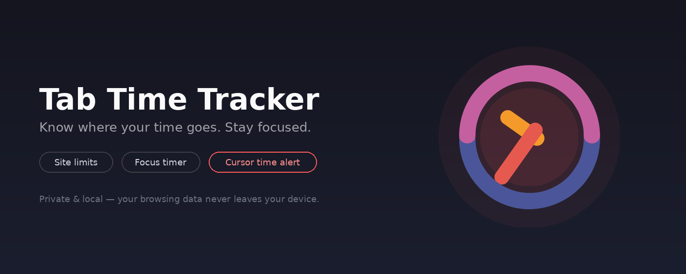

<div align="center">



# Tab Time Tracker

**Know where your time goes. Stay focused.**

A lightweight, privacy-first browser extension that tracks your time per site, warns you before you drift off task, and helps you build healthier browsing habits.

[](#-install-from-the-microsoft-edge-add-ons-store)
[](manifest.json)
[](#-privacy)

</div>

---

## Contents

- [Features](#-features)
- [Install from the Microsoft Edge Add-ons store](#-install-from-the-microsoft-edge-add-ons-store)
- [Install manually (any Chromium browser)](#-install-manually-any-chromium-browser)
- [Using the extension](#-using-the-extension)
- [Privacy](#-privacy)
- [Project structure](#-project-structure)
- [Contributing](#-contributing)
- [License](#-license)

---

## ✨ Features

**Time tracking**
- Real-time monitoring of time spent on each website domain
- Accurate tracking across tab switches and active sessions
- Daily summaries with per-domain stats, automatically reset at midnight
- 35-day activity heatmap and multi-day analytics charts

**Focus & productivity**
- Daily browsing limit with quick presets (1h / 6h / 12h)
- Per-site time limits, separate from your overall daily limit
- Site blocklist and stricter scheduled limits during work hours
- Built-in Pomodoro focus timer
- **Cursor time alert** — your cursor glows red and blinks faster the closer you get to a limit, so you notice even if you've drifted off task
- Browser badge + notifications as you approach or exceed a limit
- Site labeling (productive / neutral / distracting) with a productivity score
- Daily streaks for staying under your limit

**Personalization**
- Light and dark mode
- Drag-and-drop reordering of your site list

**Extras**
- Optional sync of your settings across devices via your browser account
- Optional Google Calendar integration to auto-block distracting sites during meetings
- Export your data anytime as CSV or JSON

---

## 🧩 Install from the Microsoft Edge Add-ons store

The easiest way to get Tab Time Tracker:

1. Open the [Tab Time Tracker listing on the Microsoft Edge Add-ons store](
https://microsoftedge.microsoft.com/addons/detail/aoecofhfffbfnkekppdgicmnfjmfdmoe) *(replace this link with your published listing URL once it's live)*.
2. Click **Get** (or **Add to Microsoft Edge**).
3. Confirm the permissions prompt by clicking **Add extension**.
4. Pin it for easy access: click the puzzle-piece **Extensions** icon in Edge's toolbar, then click the pin next to **Tab Time Tracker**.
5. Click the icon any time to open the popup and see today's stats.

> Not published yet? See [Install manually](#-install-manually-any-chromium-browser) below — it works today without waiting on store review.

---

## 🛠 Install manually (any Chromium browser)

Works in Edge, Chrome, Brave, and other Chromium-based browsers.

1. **Download** this repository — click **Code → Download ZIP** on GitHub, or:
   ```bash
   git clone https://github.com/ShaikAyub7/Chrome-Extension.git
   ```
2. **Unzip** it if needed, so you have a plain folder containing `manifest.json`.
3. Open your browser's extensions page:
   - Edge: `edge://extensions`
   - Chrome: `chrome://extensions`
4. Turn on **Developer mode** (toggle, usually top-right).
5. Click **Load unpacked**.
6. Select the extension folder (the one with `manifest.json` in it).
7. Tab Time Tracker now appears in your toolbar — pin it for quick access.

To update later: pull the latest changes (or download the new ZIP), then click the reload icon (⟳) on the extension's card in `edge://extensions` / `chrome://extensions`.

---

## 🚀 Using the extension

1. Install the extension — it starts tracking active tab time automatically.
2. Click the toolbar icon to open the popup and view today's stats.
3. Set a daily limit (**Settings** tab) using a preset or a custom value.
4. Optionally add per-site limits, a blocklist, or a stricter work-hours schedule (**Focus** tab).
5. As you approach a limit, you'll get a notification and your cursor will start to glow — faster and redder the closer you get.
6. Check the **Analytics** tab for your top sites, productivity score, and 35-day heatmap.

---

## 🔒 Privacy

- All browsing data is stored **locally on your device**.
- Nothing is collected, sold, or transmitted to any server.
- Optional sync uses your browser's own built-in account sync — Tab Time Tracker has no backend of its own.
- You can export (CSV/JSON) or permanently clear all data at any time from **Settings**.

---

## 📁 Project structure

```
.
├── manifest.json           Extension manifest (Manifest V3)
├── background.js           Service worker: tab tracking, alarms, notifications
├── content.js / script.js  Popup UI logic
├── features.js             Wires up Dashboard, Sync & Calendar modules
├── popup.html               Popup UI markup
├── style.css / features.css Popup styling
├── components/
│   ├── cursor-alert.js     Content script: the glowing cursor warning
│   ├── dashboard.js        Site ordering & mini clock
│   ├── sync.js             Cross-device settings sync
│   └── google-calendar.js  Calendar-based auto-block
├── images/                  Icons and logo
└── docs/                    README assets
```

---

## 🤝 Contributing

Issues and pull requests are welcome. If you're proposing a larger change, please open an issue first to discuss what you'd like to change.

1. Fork the repo
2. Create a branch: `git checkout -b feature/my-feature`
3. Make your changes and load the extension unpacked to test (see above)
4. Commit and open a pull request

---

## 📄 License

Licensed under the [PolyForm Noncommercial License 1.0.0](LICENSE) — anyone may use, modify, and share this project for **noncommercial purposes**. Selling it, or any modified version of it, is not permitted.s

